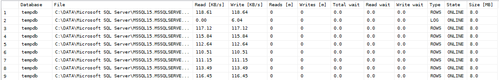
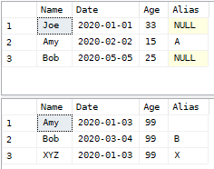
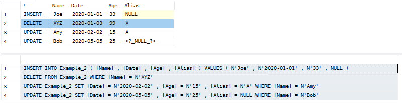
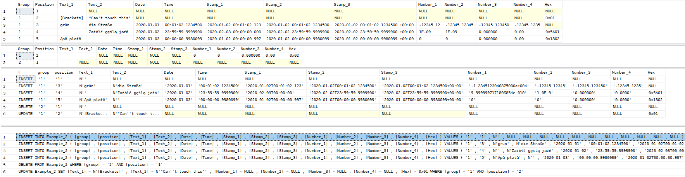

Microsoft SQL Server
====================

Every stored procedure has at least one parameter **@Help** which may be used to display usage information.

You may also find **@Pretend** parameter useful to check what SQL query will be used to produce results.

Have fun.

[Installation script for all functions **SQLServer-All.sql** →](../../sql/SQLServer-All.sql)
[download](https://raw.githubusercontent.com/zoltraks/need-more-space/master/sql/SQLServer-All.sql)

Simple check if scripts are working correctly.

```sql
EXEC x_SystemVersion
```

```sql
EXEC dbo.x_SystemVersion
```

```sql
EXEC [DBAtools].dbo.x_SystemVersion
```

You may also remove all installed functions by using **SQLServer-Purge.sql** script.

[Script for removing all functions **SQLServer-Purge.sql** →](../../sql/SQLServer-Purge.sql)
[download](https://raw.githubusercontent.com/zoltraks/need-more-space/master/sql/SQLServer-Purge.sql)

[↑ Up ↑](#microsoft-sql-server)

Maintenance Tips
----------------

[↑ Up ↑](#microsoft-sql-server)

## Basic configuration

```sql
SELECT  
  SERVERPROPERTY('MachineName') AS Computer
  ,
  SERVERPROPERTY('ServerName') AS Instance
  ,
  SERVERPROPERTY('Collation') AS Collation
```

## Default paths

```sql
SELECT
  DefaultDataPath = SERVERPROPERTY('InstanceDefaultDataPath')
  ,
  DefaultLogPath = SERVERPROPERTY('InstanceDefaultLogPath')
  ,
  DefaultBackupPath = SERVERPROPERTY('InstanceDefaultBackupPath')
```

[↑ Up ↑](#microsoft-sql-server)

Database Preparation
--------------------

[↑ Up ↑](#microsoft-sql-server)

You may skip this option if you already have database catalog needed for installation scripts.

Or you might choose to follow some of following examples to create **[monitor]** user and **[DBAtools]** catalog with desired configuration.

### Catalog ###

It is recommended to create separate database catalog like **DBAtools** for utility scripts.

```
CREATE DATABASE [DBAtools] ON PRIMARY
( NAME = N'DBAtools', FILENAME = N'C:\DATA\Microsoft SQL Server\DBAtools.mdf'
, SIZE = 2048KB , FILEGROWTH = 10240KB )
LOG ON
( NAME = N'DBAtools_log', FILENAME = N'C:\DATA\Microsoft SQL Server\DBAtools_log.ldf'
, SIZE = 1024KB , FILEGROWTH = 10240KB )
```

### User ###

```sql
CREATE LOGIN [monitor] WITH PASSWORD=N'Secret@123' , DEFAULT_DATABASE=[master] , CHECK_EXPIRATION=OFF , CHECK_POLICY=OFF
```

```sql
CREATE USER [monitor] FOR LOGIN [monitor]
```

To change password for existing user use this example.

```sql
ALTER LOGIN [monitor] WITH PASSWORD=N'Secret@321'
```

Enable **Activity Monitor** in **SQL Server Management Studio**.

```sql
GRANT VIEW SERVER STATE TO [monitor]
```

Allow trace in **SQL Server Profiler**.

```sql
GRANT ALTER TRACE TO [monitor]
```

Allow to read object definitions.

```sql
GRANT VIEW ANY DEFINITION TO [monitor]
```

Enable advanced monitoring usage.

```sql
USE [model]
GO
CREATE USER [monitor] FOR LOGIN [monitor]
GO
USE [msdb]
GO
CREATE USER [monitor] FOR LOGIN [monitor]
GO
USE [msdb]
GO
ALTER ROLE [db_datareader] ADD MEMBER [monitor]
GO
```

### Owner ###

Probably better to have different user like **[dba]** for operational access and this user should be owner of **[DBAtools]** database. For other users like **[monitor]** execution permission permission should be granted (sww below).

Unsafe, but if you still need, here you have a template.

```sql
USE [DBAtools]
GO
CREATE USER [monitor] FOR LOGIN [monitor]
GO
ALTER ROLE [db_owner] ADD MEMBER [monitor]
GO
```

### Access ###

Additional execution permissions may be needed for users.

```sql
USE [DBAtools]
GO
GRANT SELECT ON dbo.v_WaitType TO [monitor]
GRANT SELECT ON dbo.v_SplitText TO [monitor]
GO
GRANT EXECUTE ON dbo.x_CompareData TO [monitor]
GRANT EXECUTE ON dbo.x_CopyData TO [monitor]
GRANT EXECUTE ON dbo.x_DefaultConstraint TO [monitor]
GRANT EXECUTE ON dbo.x_FileConfiguration TO [monitor]
GRANT EXECUTE ON dbo.x_FileSpeed TO [monitor]
GRANT EXECUTE ON dbo.x_FindDuplicates TO [monitor]
GRANT EXECUTE ON dbo.x_IdentitySeed TO [monitor]
GRANT EXECUTE ON dbo.x_OperationStatus TO [monitor]
GRANT EXECUTE ON dbo.x_ScheduleJob TO [monitor]
GRANT EXECUTE ON dbo.x_ShowIndex TO [monitor]
GRANT EXECUTE ON dbo.x_SystemMemory TO [monitor]
GRANT EXECUTE ON dbo.x_SystemVersion TO [monitor]
GO
```

```sql
GRANT SELECT ON [DBAtools].dbo.v_WaitType TO [monitor]
```

### Check ###

```sql
EXEC dbo.x_SystemVersion
```

[↑ Up ↑](#microsoft-sql-server)

Show index
----------

[↑ Up ↑](#microsoft-sql-server)

[Installation script for x_ShowIndex →](../../sql/SQLServer/x_ShowIndex.sql)

Show indexes and optionally columns included for one or more tables.

```
EXEC x_ShowIndex @Help=1
```

| Parameter | Type | Description |                                                            
| --------- | ---- | ----------- |
| @Database | NVARCHAR(128) | Database name |
| @Schema | NVARCHAR(128) | Schema name |
| @Table | NVARCHAR(128) | Table name |
| @Expand | BIT | Show index columns |
| @Clustered | BIT | Show clustered (1) or non-clustered (0) indexes |
| @Unique | BIT | Show unique (1) or non-unique (0) indexes |
| @Primary | BIT | Show primary (1) or non-primary (0) indexes |
| @Pretend | BIT | Print query to be executed but don't do anything |
| @Help | BIT | Show this help |

```
EXEC x_ShowIndex @Pretend=1
```

```sql
SELECT
    [Schema] = s.name , [Table] = t.name , [Index] = i.name , [Column] = c.name
    ,
    [Clustered] = CASE WHEN i.index_id = 1 THEN 1 ELSE 0 END , [Unique] = i.is_unique , [Primary] = i.is_primary_key
FROM
    sys.tables t
INNER JOIN
    sys.indexes i ON t.object_id = i.object_id
INNER JOIN
    sys.index_columns ic ON i.index_id = ic.index_id AND i.object_id = ic.object_id
INNER JOIN
    sys.columns c ON ic.column_id = c.column_id AND ic.object_id = c.object_id
INNER JOIN
    sys.schemas s ON t.schema_id = s.schema_id
WHERE
    i.name IS NOT NULL
ORDER BY
    s.name , t.name , i.name
```

```
EXEC x_ShowIndex @Database='Sales',@Schema='Customers',@Expand=1,@Pretend=1
```

```sql
USE [Sales]
SELECT
    [Schema] = s.name , [Table] = t.name , [Index] = i.name , [Column] = c.name
    ,
    [Clustered] = CASE WHEN i.index_id = 1 THEN 1 ELSE 0 END
    ,
    [Unique] = i.is_unique
    ,
    [Primary] = i.is_primary_key
FROM
    sys.tables t
INNER JOIN 
    sys.indexes i ON t.object_id = i.object_id
INNER JOIN
    sys.schemas s ON t.schema_id = s.schema_id
INNER JOIN 
    sys.index_columns ic ON i.index_id = ic.index_id AND i.object_id = ic.object_id
INNER JOIN 
    sys.columns c ON ic.column_id = c.column_id AND ic.object_id = c.object_id
WHERE
    i.name IS NOT NULL
AND
    s.name = N'Customers'
ORDER BY
    s.name , t.name , i.name
```

```
EXEC x_ShowIndex
```

| Schema | Table | Index | Column | Clustered | Unique | Primary |
| ------ | ----- | ----- | ------ | --------- | ------ | ------- |
| dbo | BlitzCache | PK_EB450450-26B6-4AB4-AFF3-4D773F3C5C38 | ID | 1 | 1 | 1 |
| dbo | BlitzFirst | PK__BlitzFir__3214EC270DAF0CB0 | ID | 1 | 1 | 1
| dbo | BlitzFirst_FileStats | PK__BlitzFir__3214EC27117F9D94 | ID | 1 | 1 | 1 |
| dbo | BlitzFirst_PerfmonStats | PK__BlitzFir__3214EC27164452B1 | ID | 1 | 1 | 1 |
| dbo | BlitzFirst_WaitStats | IX_ServerName_wait_type_CheckDate_Includes | ServerName | 0 | 0 | 0 |
| dbo | BlitzFirst_WaitStats | IX_ServerName_wait_type_CheckDate_Includes | wait_type | 0 | 0 | 0 |
| dbo | BlitzFirst_WaitStats | IX_ServerName_wait_type_CheckDate_Includes | CheckDate | 0 | 0 | 0 |
| dbo | BlitzFirst_WaitStats | IX_ServerName_wait_type_CheckDate_Includes | wait_time_ms | 0 | 0 | 0 |
| dbo | BlitzFirst_WaitStats | IX_ServerName_wait_type_CheckDate_Includes | signal_wait_time_ms | 0 | 0 | 0 |
| dbo | BlitzFirst_WaitStats | IX_ServerName_wait_type_CheckDate_Includes | waiting_tasks_count | 0 | 0 | 0 |
| dbo | BlitzFirst_WaitStats | PK__BlitzFir__3214EC271BFD2C07 | ID | 1 | 1 | 1 |
| dbo | CommandLog | PK_CommandLog | ID | 1 | 1 | 1 |

[↑ Up ↑](#microsoft-sql-server)

Operation status
----------------

[↑ Up ↑](#microsoft-sql-server)

[Installation script for x_OperationStatus →](../../sql/SQLServer/x_OperationStatus.sql)

Show system operation status.

Simply display what database server is doing now.

This procedure has no relevant parameters.

```
EXEC x_OperationStatus
```

| Database | Command | Status | % | Wait type | Start time | Reads | Writes | Time taken | CPU Time | Time left | Session | Query text |                      
| -------- | ------- | ------ | - | --------- | ---------- | ----- | ------ | ---------- | -------- | --------- | ------- | ---------- |         
| master | RESTORE&nbsp;DATABASE | suspended | 5.60 | BACKUPTHREAD | 2019-11-01 09:52:34.973 | 2 | 0 | 00:50 | 00:00 | 14:03 | 87 | RESTORE DATABASE [ExampleTemp] FROM  DISK = N'E:\SQLBackups\Example\Example_backup_2019_10_30_160003_0084574.tlog' WITH  FILE = 2, MOVE N' Example' TO N'E:\Temp\ExampleTemp.mdf', MOVE N' Example_log' TO N'E:\Temp\ExampleTemp_log.ldf', NORECOVERY, NOUNLOAD, REPLACE, STATS = 10 | 
| master | SELECT | suspended | 0.00 | TRACEWRITE | 2019-11-01 07:40:00.500 | 0 | 0 | 33:25 | 00:00 | 00:00 | 76 | create procedure sys.sp_trace_getdata | (@traceid int, |  @records int = 0 | )asselect * from OpenRowset(TrcData, @traceid, @records) |
|  ExampleTemp | UPDATE | suspended | 0.00 | WRITELOG | 2019-11-01 09:53:25.357 | 0 | 0 | 00:00 | 00:00 | 00:00 | 71 | (@data datetime)UPDATE SomeTable SET stamp=@data WHERE id = 229074 |
| ExampleTemp | CONDITIONAL | running | 0.00 | NULL | 2019-11-01 10:08:10.717 | 0 | 0 | 00:00 | 00:00 | 00:00 | 97 | IF NOT EXISTS ( SELECT 1 FROM INFORMATION_SCHEMA. COLUMNS WHERE TABLE_NAME = 'ExampleTable' AND COLUMN_NAME = 'MissingColumn' ) | ALTER TABLE [ExampleTable] ADD [MissingColumn] FLOAT NULL...
| ExampleTemp | ALTER TABLE | running | 0.00 | NULL | 2019-11-01 10:08:12.067 | 713075 | 1884865 | 02:16 | 01:46 | 00:00 | 97 | UPDATE [ExampleTemp].[dbo].[ExampleTable] SET [CounterColumn] = [CounterColumn] |
| OtherDb | CONDITIONAL | suspended | 0.00 | PAGEIOLATCH_SH | 2019-11-01 10:16:00.437 | 47445 | 0 | 00:14 | 00:00 | 00:00 | 97 | IF EXISTS ( SELECT TOP 1 1 FROM [a_batch] WHERE [stamp] IS NULL ) UPDATE [a_batch] SET [stamp] = GETDATE()... |

Identity seed
------------------

Show identity seed value for tables in database.

Generate report for all tables and identity column seed value together
with DBCC CHECKIDENT ( '[table]' , RESEED , 434342 ) script pattern to recreate it manually.

```
EXEC x_IdentitySeed @Help=1
```

```sql
EXEC x_IdentitySeed @Database='DbName'
```

[↑ Up ↑](#microsoft-sql-server)

Find duplicates
---------------

[↑ Up ↑](#microsoft-sql-server)

[Installation script for x_FindDuplicates →](../../sql/SQLServer/x_FindDuplicates.sql)

Find duplicates in table.

```
EXEC x_FindDuplicates @Help=1
```

| Parameter | Type | Description |
| --------- | ---- | ----------- |
| @Table | NVARCHAR(515) | Table name |
| @Columns | NVARCHAR(MAX) | Column list separated by comma, semicolon or whitespace (i.e."col1, [Other One] , col2") |
| @Expand | NVARCHAR(MAX) | Expand results by including additional columns for duplicated records |
| @Where | NVARCHAR(MAX) | Optional filter for WHERE |
| @Top | INT | Maximum count of rows |
| @Pretend | BIT | Print query to be executed but don't do anything |
| @Help | BIT | Show this help |

```
EXEC x_FindDuplicates @Table = 'MyDb.dbo.MyTable' , @Columns = 'column1 , [Other One] , Col3' , @Pretend = 1 ;
```

```sql
SELECT
    [column1] , [Other One] , [Col3]
    ,
    [Count] = COUNT(*)
FROM
    MyDb.dbo.MyTable
GROUP BY
    [column1] , [Other One] , [Col3]
HAVING
    COUNT(*) > 1
ORDER BY
    [column1] , [Other One] , [Col3]
```

You may want to expand your results by showing each duplicate record for further analysis.

```
EXEC x_FindDuplicates @Table = 'MyDb.dbo.MyTable' , @Columns = 'year,day' , @Expand = 'id , stamp' , @Pretend = 1 ;
```

```sql
WITH __X__ AS
(
    SELECT
    [year] , [day]
    FROM
        MyDb.dbo.MyTable
    GROUP BY
        [year] , [day]
    HAVING
        COUNT(*) > 1
)
SELECT
    __X__.* , __Y__.[id] , __Y__.[stamp]
FROM
    __X__
LEFT JOIN
    MyDb.dbo.MyTable __Y__ ON __X__.[year] = __Y__.[year] AND __X__.[day] = __Y__.[day]
ORDER BY
    __X__.[year] , __X__.[day] , __Y__.[id] , __Y__.[stamp]
```

[↑ Up ↑](#microsoft-sql-server)

File configuration
------------------

[↑ Up ↑](#microsoft-sql-server)

[Installation script for x_FileConfiguration →](../../sql/SQLServer/x_FileConfiguration.sql)

Show database files configuration.

```
EXEC x_FileConfiguration @Help=1
```

| Parameter | Type | Description |
| --------- | ---- | ----------- |
| @Database | NVARCHAR(260) | Database name |
| @Pretend | BIT | Print query to be executed but don't do anything |
| @Help | BIT | Show this help |

```
EXEC x_FileConfiguration @Database = 'TempDB' , @Pretend = 1 ;
```

```sql
SELECT
    [Name] = [name]
    ,
    [Size (MB)] = CONVERT(INT , [size] / 128.0)
    ,
    [Autogrowth] = CASE [max_size] WHEN 0 THEN 'OFF' WHEN -1 THEN 'UNLIMITED' ELSE 'LIMITED' END
    ,
    [Growth (MB)] = CASE WHEN [is_percent_growth] = 0 THEN CONVERT(BIGINT , [growth] / 128.0) ELSE 0 END
    ,
    [Growth (%)] = CASE WHEN [is_percent_growth] = 1 THEN CONVERT(INT , [growth]) ELSE 0 END
    ,
    [State] = [state_desc]
    ,
    [Limit (MB)] = CASE WHEN [max_size] <= 0 THEN [max_size] ELSE CONVERT(INT , [max_size] / 128.0 / 1024.0 ) END
    ,
    [Number] = [file_id]
    ,
    [Type] = CASE WHEN [type] = 0 THEN 'DATA' ELSE 'LOG' END
    ,
    [File] = [physical_name]
FROM
    [TempDB].sys.database_files
```

```
EXEC x_FileConfiguration @Database = 'TempDB' ;
```

| Name | Size (MB) | Autogrowth | Growth (MB) | Growth (%) | State | Limit (MB) | Number | Type | File |
| ---- | --------- | ---------- | ----------- | ---------- | ----- | ---------- | ------ | ---- | ---- |
| tempdev | 1278 | UNLIMITED | 10 | 0 | ONLINE | -1 | 1 | DATA | F:\DATABASE\TempDB\tempdev.mdf |
| templog | 50 | UNLIMITED | 10 | 0 | ONLINE | -1 | 2 | LOG | F:\DATABASE\TempDB\templog.ldf |
| tempdev02 | 1268 | UNLIMITED | 10 | 0 | ONLINE | -1 | 3 | DATA | F:\DATABASE\TempDB\tempdev02.mdf |
| tempdev03 | 1268 | UNLIMITED | 10 | 0 | ONLINE | -1 | 4 | DATA | F:\DATABASE\TempDB\tempdev03.mdf |
| tempdev04 | 1268 | UNLIMITED | 10 | 0 | ONLINE | -1 | 5 | DATA | F:\DATABASE\TempDB\tempdev04.mdf |
| tempdev05 | 1268 | UNLIMITED | 10 | 0 | ONLINE | -1 | 6 | DATA | F:\DATABASE\TempDB\tempdev05.mdf |
| tempdev06 | 1268 | UNLIMITED | 10 | 0 | ONLINE | -1 | 7 | DATA | F:\DATABASE\TempDB\tempdev06.mdf |
| tempdev07 | 1268 | UNLIMITED | 10 | 0 | ONLINE | -1 | 8 | DATA | F:\DATABASE\TempDB\tempdev07.mdf |
| tempdev08 | 1268 | UNLIMITED | 10 | 0 | ONLINE | -1 | 9 | DATA | F:\DATABASE\TempDB\tempdev08.mdf |
| tempdev09 | 1268 | UNLIMITED | 10 | 0 | ONLINE | -1 | 10 | DATA | F:\DATABASE\TempDB\tempdev09.mdf |
| tempdev10 | 1268 | UNLIMITED | 10 | 0 | ONLINE | -1 | 11 | DATA | F:\DATABASE\TempDB\tempdev10.mdf |
| tempdev11 | 1268 | UNLIMITED | 10 | 0 | ONLINE | -1 | 12 | DATA | F:\DATABASE\TempDB\tempdev11.mdf |
| tempdev12 | 1278 | UNLIMITED | 10 | 0 | ONLINE | -1 | 13 | DATA | F:\DATABASE\TempDB\tempdev12.mdf |
| tempdev01 | 1278 | UNLIMITED | 10 | 0 | ONLINE | -1 | 14 | DATA | F:\DATABASE\TempDB\tempdev01.mdf |

[↑ Up ↑](#microsoft-sql-server)

File speed
----------

[↑ Up ↑](#microsoft-sql-server)

[Installation script for x_FileSpeed →](../../sql/SQLServer/x_FileSpeed.sql)

Show I/O speed of database files.

Please note that user has to be able to read ``sys.master_files``.

select * from sys.master_files

```
EXEC x_FileSpeed @Help=1
```

| Parameter | Type | Description |
| --------- | ---- | ----------- |
| @Database | NVARCHAR(260) | Database name |
| @Sample | INT | Sample time in seconds. Default is 30 seconds and minimum value is 10 seconds. |
| @CountPerSecond | BIT | Display total reads and writes per second rather than per minute which is default. |
| @ActivityOnly | BIT | Exclude rows where there is no activity. |
| @Pretend | BIT | Print query to be executed but don't do anything |
| @Help | BIT | Show this help |

```
EXEC x_FileSpeed @Database = 'TempDB' , @Sample = 90 , @ActivityOnly = 1 ,  @Pretend = 1
```

```sql
DECLARE @_t_1 TABLE (
  [Database] NVARCHAR (128) ,
  [DatabaseID] INT ,
  [File] NVARCHAR(260) ,
  [FileID] INT ,
  [ReadBytes] BIGINT ,
  [WriteBytes] BIGINT ,
  [ReadCount] BIGINT ,
  [WriteCount] BIGINT ,
  [TotalWait] BIGINT ,
  [ReadWait] BIGINT ,
  [WriteWait] BIGINT
)

DECLARE @_t_2 TABLE (
  [Database] NVARCHAR (128) ,
  [DatabaseID] INT ,
  [File] NVARCHAR(260) ,
  [FileID] INT ,
  [ReadBytes] BIGINT ,
  [WriteBytes] BIGINT ,
  [ReadCount] BIGINT ,
  [WriteCount] BIGINT ,
  [TotalWait] BIGINT ,
  [ReadWait] BIGINT ,
  [WriteWait] BIGINT
)

INSERT INTO @_t_1
SELECT     
    d.[name] [Database] ,
    d.[database_id] [DatabaseID] ,
    f.[physical_name] [File] , 
    f.[file_id] [FileID] , 
    s.[num_of_bytes_read] [ReadBytes] , 
    s.[num_of_bytes_written] [WriteBytes] ,
    s.[num_of_reads] [ReadCount] ,
    s.[num_of_writes] [WriteCount] ,
    s.[io_stall] [TotalWait] , 
    s.[io_stall_read_ms] [ReadWait] ,
    s.[io_stall_write_ms] [WriteWait]
FROM sys.dm_io_virtual_file_stats(DB_ID(N'TempDB') , DEFAULT) s
INNER JOIN sys.master_files f ON s.database_id = f.[database_id] AND s.[file_id] = f.[file_id]
INNER JOIN sys.databases d ON d.[database_id] = s.[database_id]

WAITFOR DELAY '00:01:30'

INSERT INTO @_t_2
SELECT     
    d.[name] [Database] ,
    d.[database_id] [DatabaseID] ,
    f.[physical_name] [File] , 
    f.[file_id] [FileID] , 
    s.[num_of_bytes_read] [ReadBytes] , 
    s.[num_of_bytes_written] [WriteBytes] ,
    s.[num_of_reads] [ReadCount] ,
    s.[num_of_writes] [WriteCount] ,
    s.[io_stall] [TotalWait] , 
    s.[io_stall_read_ms] [ReadWait] ,
    s.[io_stall_write_ms] [WriteWait]
FROM sys.dm_io_virtual_file_stats(DB_ID(N'TempDB') , DEFAULT) s
INNER JOIN sys.master_files f ON s.database_id = f.[database_id] AND s.[file_id] = f.[file_id]
INNER JOIN sys.databases d ON d.[database_id] = s.[database_id]

SELECT
    a.[Database] , a.[File]
    ,
    CONVERT(DECIMAL(18,2) , (b.[ReadBytes] - a.[ReadBytes]) / 1024.0 / 90.0) [Read [KB/s]]]
    , 
    CONVERT(DECIMAL(18,2) , (b.[WriteBytes] - a.[WriteBytes]) / 1024.0 / 90.0) [Write [KB/s]]]
    , 
    CONVERT(DECIMAL(18,0) , CEILING((b.[ReadCount] - a.[ReadCount]) / 60.0 / 90.0)) [Reads [m]]]
    , 
    CONVERT(DECIMAL(18,0) , CEILING((b.[WriteCount] - a.[WriteCount]) / 60.0 / 90.0)) [Writes [m]]]
    ,
    CONVERT(DECIMAL(18,1) , (b.[TotalWait] - a.[TotalWait]) / 1000.0 / 90.0) [Total wait]
    ,
    CONVERT(DECIMAL(18,1) , (b.[ReadWait] - a.[ReadWait]) / 1000.0 / 90.0) [Read wait]
    ,
    CONVERT(DECIMAL(18,1) , (b.[WriteWait] - a.[WriteWait]) / 1000.0 / 90.0) [Write wait]
    , 
    f.[type_desc] [Type] , f.[state_desc] [State]
    ,
    CONVERT(DECIMAL(18,1) , 8.0 * f.[size] / 1024.0) [Size [MB]]]
FROM sys.master_files f
JOIN @_t_1 a ON f.[database_id] = a.[DatabaseID] AND f.[file_id] = a.[FileID]
JOIN @_t_2 b ON f.[database_id] = b.[DatabaseID] AND f.[file_id] = b.[FileID]
WHERE 
    b.[ReadBytes] - a.[ReadBytes] > 0 OR
    b.[WriteBytes] - a.[WriteBytes] > 0 OR
    b.[ReadCount] - a.[ReadCount] > 0 OR
    b.[WriteCount] - a.[WriteCount] > 0 OR
    b.[TotalWait] - a.[TotalWait] > 50 OR
    b.[ReadWait] - a.[ReadWait] > 50 OR
    b.[WriteWait] - a.[WriteWait] > 50
```



[↑ Up ↑](#microsoft-sql-server)

System memory
-------------

[↑ Up ↑](#microsoft-sql-server)

[Installation script for x_SystemMemory →](../../sql/SQLServer/x_SystemMemory.sql)

Show basic information about memory amount and state.

This procedure has no relevant parameters.

```
EXEC x_SystemMemory ;
```

| Physical memory (MB) | Available memory (MB) | Total page file (MB) | Available page file (MB) | System cache (MB) | Memory used (MB) | Memory state |
| -------------------- | --------------------- | -------------------- | ------------------------ | ----------------- | ---------------- | ------------ |
| 65535 | 5795 | 131069 | 70972 | 1435 | 56484 | Available physical memory is high |

System version
--------------

[Installation script for x_SystemVersion →](../../sql/SQLServer/x_SystemVersion.sql)

Show version information.

This procedure has no relevant parameters.

```
EXEC x_SystemVersion
```

| Name | Value |
| ---- | ----- |
| Version | 15.0.2000.5 |
| Product | Microsoft SQL Server 2019 (RTM) - 15.0.2000.5 (X64)   Sep 24 2019 13:48:23   Copyright (C) 2019 Microsoft Corporation  Developer Edition (64-bit) on Windows 10 Pro 10.0 <X64> (Build 18362: ) (Hypervisor)
| Edition | Developer Edition (64-bit) |
| Level | RTM |

[↑ Up ↑](#microsoft-sql-server)

Default constraint
------------------

[↑ Up ↑](#microsoft-sql-server)

[Installation script for x_DefaultConstraint →](../../sql/SQLServer/x_DefaultConstraint.sql)

Show default constraint.

This procedure may be used to show default constraints for specific tables and columns.

```
EXEC x_DefaultConstraint @Help=1
```

| Parameter | Type | Description |
| --------- | ---- | ----------- |
| @Database | NVARCHAR(128) | Database name |
| @Schema | NVARCHAR(128) | Schema name |
| @Table | NVARCHAR(128) | Table name |
| @Column | NVARCHAR(128) | Column name |
| @Constraint | NVARCHAR(128) | Constraint name |
| @Pretend | BIT | Print query to be executed but don't do anything |
| @Help | BIT | Show this help |

```
EXEC x_DefaultConstraint @Database = 'ContactList' , @Column = 'DisplayOrder' ;
```

| Schema | Table | Constraint | Column | Object | Create | Modify |
| ------ | ----- | ---------- | ------ | ------ | ------ | ------ |
| dbo | MessengerService | DF__Messenger__Displ__0519C6AF | DisplayOrder | 85575343 | 2019-11-03 14:29:17.890 | 2019-11-03 14:29:17.890 |

[↑ Up ↑](#microsoft-sql-server)

Copy data
---------

[↑ Up ↑](#microsoft-sql-server)

[Installation script for x_CopyData →](../../sql/SQLServer/x_CopyData.sql)

Copy data from one table to another.

Copying is made with simple query INSERT INTO ... SELECT FROM ... with full list of columns.

This procedure may optionally create destination table, drop it first, or delete existing data.

Will also work with linked servers.

```
EXEC x_CopyData @Help=1
```

| Parameter | Type | Description |
| --------- | ---- | ----------- |
| @Pretend | BIT | Print queries to be executed but don't do anything. Will however read column definition from source table.|
| @Help | BIT | Show this help |
| @SourceDatabase | NVARCHAR(128) | Source database name. Optional.|
| @SourceSchema | NVARCHAR(128) | Source schema name. If omited, default "dbo" will be used.|
| @SourceTable | NVARCHAR(128) | Source table name. Required.|
| @SourceServer | NVARCHAR(128) | Source linked server. Optional.|
| @DestinationDatabase | NVARCHAR(128) | Destination database name. If not specified, source database name will be used.|
| @DestinationSchema | NVARCHAR(128) | Destination schema name. If omited, default "dbo" will be used.|
| @DestinationTable | NVARCHAR(128) | Destination table name. If not specified, source table name will be used.|
| @DestinationServer | NVARCHAR(128) | Destination linked server. Optional. Be aware that trying to create or drop table will require linked server to be configured for RPC.|
| @Copy | BIT | Copy data with simple query INSERT INTO ... SELECT FROM ... with full list of columns.|
| @Create | BIT | Create destination table if not exists.|
| @Drop | BIT | Drop destination table if exists.|
| @Delete | BIT | Delete data from destination table first.|
| @Where | NVARCHAR(2000) | Optional WHERE clausule for SELECT operation.|
| @IncludeIdentity | BIT | Include identity columns for copying.|
| @IncludeComputed | BIT | Include computed columns for copying. By default computed columns are not copied nor created.|
| @IdentityNullable | BIT | Force identity column to be nullable in create table script.|

Use pretend mode to see what will be done.

```
EXEC x_CopyData @SourceDatabase = 'MyDb' , @SourceTable = 'Table1' , @DestinationDatabase = 'Backup'
  , @Pretend = 1 ;
```

```sql
INSERT INTO [Backup].[dbo].[Table1]
( [id] , [ancestor] , [line] , [description] )
SELECT
  [id] , [ancestor] , [line] , [description]
FROM [MyDb].[dbo].[Table1]
```

This little trick allows to generate CREATE TABLE script only.

```
EXEC x_CopyData @Copy = 0 , @Create = 1 , @SourceTable='Table1' , @SourceDatabase = 'MyDb' , @Pretend = 1;
```

```sql
IF OBJECT_ID(N'[MyDb].[dbo].[Table1]') IS NULL
CREATE TABLE [MyDb].[dbo].[Table1]
(
  [id] BIGINT NOT NULL ,
  [ancestor] BIGINT NULL ,
  [line] SMALLINT NULL ,
  [description] NVARCHAR(50) NULL
)
```

You may also copy data between two servers.

```
EXEC x_CopyData @Pretend = 1 , @Copy = 1 , @Create = 1 , @Drop = 1 , @Delete = 1
    , @SourceDatabase='MyDb' , @SourceTable='Table1'
    , @DestinationServer='LinkedSrv' , @DestinationDatabase='Backup' ;
```

```
EXEC (N'
IF OBJECT_ID(N''[Backup].[dbo].[Table1]'') IS NOT NULL
DROP TABLE [Backup].[dbo].[Table1]
') AT [LinkedSrv]

EXEC (N'
IF OBJECT_ID(N''[Backup].[dbo].[Table1]'') IS NULL
CREATE TABLE [Backup].[dbo].[Table1]
(
  [id] BIGINT NULL ,
  [ancestor] BIGINT NULL ,
  [line] SMALLINT NULL ,
  [description] NVARCHAR(50) NULL
)
') AT [LinkedSrv]

DELETE FROM [LinkedSrv].[Backup].[dbo].[Table1]

INSERT INTO [LinkedSrv].[Backup].[dbo].[Table1]
( [id] , [ancestor] , [line] , [description] )
SELECT
  [id] , [ancestor] , [line] , [description]
FROM [MyDb].[dbo].[Table1]
```

However linked server needs to be configured for RPC if you want to use **@Create** or **@Drop** options.

```sql
EXEC master.dbo.sp_serveroption @server=N'LinkedSrv', @optname=N'rpc', @optvalue=N'true'
GO
EXEC master.dbo.sp_serveroption @server=N'LinkedSrv', @optname=N'rpc out', @optvalue=N'true'
GO
```

It might be handy to use **@Where** parameter to filter data.

```
EXEC x_CopyData @SourceDatabase = 'MyDb' , @SourceTable = 'Table1' , @DestinationDatabase = 'Backup'
  , @Where = '[id] > 123 AND [id] < 567' , @Pretend = 1 ;
```

```sql
INSERT INTO [Backup].[dbo].[Table1]
( [id] , [ancestor] , [line] , [description] )
SELECT
  [id] , [ancestor] , [line] , [description]
FROM [MyDb].[dbo].[Table1]
WHERE [id] > 123 AND [id] < 567
```

[↑ Up ↑](#microsoft-sql-server)

Compare data
------------

[↑ Up ↑](#microsoft-sql-server)

[Installation script for x_CompareData →](../../sql/SQLServer/x_CompareData.sql)

Compare data from one table with another.

This procedure depends on function [v_SplitText](#split-text).

This procedure will query database for table structure and select key and value columns for comparisation.

It does basic conversions to ``NVARCHAR`` type for every column so it might not work with custom user types. Will work with standard types like ``CHAR``/``NCHAR``, ``VARCHAR``/``NVARCHAR``,  ``VARBINARY``, ``FLOAT``, ``DATETIME``, ``DATETIME2(n)``, etc.

If no key column is specified, identity column will be chosen if exists. It might be changed in future to automatically choose primary key columns for comparisation.

If no key column can be guessed this way, procedure will raise error.

If no value column is specified, procedure will build list of columns used for data comparisation from all possible columns from source table minus key columns used to identify records. Computed columns are not included.

```sql
EXEC x_CompareData @Help=1 ;
```

| Parameter | Type | Description |                                                            
| --------- | ---- | ----------- |
| @Help | BIT | Show this help. |
| @Source | NVARCHAR(MAX) | Full path to source table. |
| @Destination | NVARCHAR(MAX) | Full path to destination table. |
| @Keys | NVARCHAR(MAX) | Optional list of key columns. If no key column is specified, identity or primary key will be used. |
| @Values | NVARCHAR(MAX) | Optional list of value columns. Only these columns will be checked for differences. |
| @Merge | BIT | Perform required INSERT / DELETE / UPDATE operations to remove differences. |
| @Select | BIT | Show differences (default). |
| @Update | BIT | Update destination table to remove differences. |
| @Insert | BIT | Insert missing records to destination table. |
| @Delete | BIT | Delete non existing records from destination table. |
| @Alias | NVARCHAR(128) | Column alias for operation text. |
| @Null | NVARCHAR(128) | Optional text value for NULL setting. |
| @Quote | BIT | Display values quoted for SQL script. |

```sql
EXEC x_CompareData @Source='Catalog.dbo.Table_1',@Destination='Catalog.dbo.Table_1',@Pretend=1 ;
```

Using ``@Pretend`` option will result in printing exact **SQL** to be used without executing it. You might review them in **Messages** tab in ``SSMS``. 

Use folowing script to make temporary tables with different values to check this operation behaviour.

```sql
IF OBJECT_ID('Example_1' , 'U') IS NOT NULL
EXEC sp_executesql N'DROP TABLE Example_1' ;

IF OBJECT_ID('Example_2' , 'U') IS NOT NULL
EXEC sp_executesql N'DROP TABLE Example_2' ;

GO

CREATE TABLE Example_1
(
  [Name] NVARCHAR(10) NULL ,
  [Date] DATE NULL ,
  [Age] INT NULL ,
  [Alias] NVARCHAR(20) NULL
) ;

CREATE TABLE Example_2
(
  [Name] NVARCHAR(10) NULL ,
  [Date] DATE NULL ,
  [Age] INT NULL ,
  [Alias] NVARCHAR(20) NULL
) ;

INSERT INTO Example_1 ( [Name] , [Date] , [Age] , [Alias] )
VALUES ( 'Joe' , '2020-01-01' , 33 , NULL ) ;
INSERT INTO Example_1 ( [Name] , [Date] , [Age] , [Alias] )
VALUES ( 'Amy' , '2020-02-02' , 15 , 'A' ) ;
INSERT INTO Example_1 ( [Name] , [Date] , [Age] , [Alias] )
VALUES ( 'Bob' , '2020-05-05' , 25 , NULL ) ;

INSERT INTO Example_2 ( [Name] , [Date] , [Age] , [Alias] )
VALUES ( 'Amy' , '2020-01-03' , 99 , '' ) ;
INSERT INTO Example_2 ( [Name] , [Date] , [Age] , [Alias] )
VALUES ( 'Bob' , '2020-03-04' , 99 , 'B' ) ;
INSERT INTO Example_2 ( [Name] , [Date] , [Age] , [Alias] )
VALUES ( 'XYZ' , '2020-01-03' , 99 , 'X' ) ;

GO

SELECT * FROM Example_1 ;
SELECT * FROM Example_2 ;

GO

DROP TABLE Example_1 ;
DROP TABLE Example_2 ;

GO
```



```sql
EXEC x_CompareData @Source='Example_1',@Destination='Example_2',@Keys='Name'
```

This operation will perform basic comparisation and by default it will output two reports.

One is difference report, second will be list of queries to be executed to remove these differences.



And here is how it should be read.

First column of difference report is default named exclamation mark ``!`` and states what kind of difference you have. Possible values are ``INSERT``, ``DELETE`` or ``UPDATE``.

First is ``INSERT`` which means that this record was misssing and has to be inserted.

Second is ``DELETE`` because this record exists in destination table but has no appropriate record in source, thus it should be removed.

Last two are differences. If a column has no difference, NULL value will be returned. Because of that, special ``<?_NULL_?>`` text is used to indicate that column should be nullified.

This operation does not make any changes to database unless ``@Merge`` parameter is set to ``1``.

Additionaly, you may use ``@Pretend`` to see in messages operation that has to be made to create these reports.

```
EXEC x_CompareData @Source='Example_1',@Destination='Example_2',@Keys='Name',@Pretend=1
```

In pretend mode you can see generated SQL queries that will be used by this procedure.

```
SELECT 'INSERT' AS [!] , a.[Name] AS [Name] , CONVERT(VARCHAR(10) , a.[Date] , 126) AS [Date] , CONVERT(VARCHAR(11) , a.[Age] , 3) AS [Age] , a.[Alias] AS [Alias]
FROM Example_1 a
LEFT JOIN Example_2 b ON a.[Name] = b.[Name]
WHERE b.[Name] IS NULL
UNION ALL
SELECT 'DELETE' AS [!] , a.[Name] AS [Name] , CONVERT(VARCHAR(10) , a.[Date] , 126) AS [Date] , CONVERT(VARCHAR(11) , a.[Age] , 3) AS [Age] , a.[Alias] AS [Alias]
FROM Example_2 a
LEFT JOIN Example_1 b ON a.[Name] = b.[Name]
WHERE b.[Name] IS NULL
UNION ALL
SELECT 'UPDATE' AS [!] , a.[Name] AS [Name] , CASE WHEN a.[Date] IS NULL AND b.[Date] IS NULL THEN NULL WHEN a.[Date] IS NULL AND b.[Date] IS NOT NULL THEN '<?_NULL_?>' WHEN a.[Date] = b.[Date] THEN NULL ELSE CONVERT(VARCHAR(10) , a.[Date] , 126) END AS [Date] , CASE WHEN a.[Age] IS NULL AND b.[Age] IS NULL THEN NULL WHEN a.[Age] IS NULL AND b.[Age] IS NOT NULL THEN '<?_NULL_?>' WHEN a.[Age] = b.[Age] THEN NULL ELSE CONVERT(VARCHAR(11) , a.[Age] , 3) END AS [Age] , CASE WHEN a.[Alias] IS NULL AND b.[Alias] IS NULL THEN NULL WHEN a.[Alias] IS NULL AND b.[Alias] IS NOT NULL THEN '<?_NULL_?>' WHEN a.[Alias] = b.[Alias] THEN NULL ELSE a.[Alias] END AS [Alias]
FROM Example_1 a
JOIN Example_2 b ON a.[Name] = b.[Name]
WHERE ( a.[Date] IS NULL AND b.[Date] IS NOT NULL OR a.[Date] IS NOT NULL AND b.[Date] IS NULL OR a.[Date] <> b.[Date] ) OR ( a.[Age] IS NULL AND b.[Age] IS NOT NULL OR a.[Age] IS NOT NULL AND b.[Age] IS NULL OR a.[Age] <> b.[Age] ) OR ( a.[Alias] IS NULL AND b.[Alias] IS NOT NULL OR a.[Alias] IS NOT NULL AND b.[Alias] IS NULL OR a.[Alias] <> b.[Alias] )
```

More sophisticaded example using several data types. Suitable for testing purposes.

```sql
IF OBJECT_ID('Example_1' , 'U') IS NOT NULL
EXEC sp_executesql N'DROP TABLE Example_1' ;

IF OBJECT_ID('Example_2' , 'U') IS NOT NULL
EXEC sp_executesql N'DROP TABLE Example_2' ;

GO

CREATE TABLE Example_1
(
  [Group] INT NOT NULL ,
  [Position] TINYINT NOT NULL ,
  [Text_1] NVARCHAR(10) NOT NULL ,
  [Text_2] NTEXT NULL ,
  [Date] DATE NULL ,
  [Time] TIME NULL ,
  [Stamp_1] DATETIME NULL ,
  [Stamp_2] DATETIME2(7) NULL ,
  [Stamp_3] DATETIMEOFFSET NULL ,
  [Number_1] REAL NULL,
  [Number_2] FLOAT NULL,
  [Number_3] DECIMAL(18,6) NULL,
  [Number_4] MONEY NULL,
  [Hex] VARBINARY(MAX) NULL ,
  CONSTRAINT [PK_Example_1_Identity] PRIMARY KEY CLUSTERED
	(
		[Group] , [Position]
	)
) ;

CREATE TABLE Example_2
(
  [Group] INT NOT NULL ,
  [Position] TINYINT NOT NULL ,
  [Text_1] NVARCHAR(10) NOT NULL ,
  [Text_2] NTEXT NULL ,
  [Date] DATE NULL ,
  [Time] TIME NULL ,
  [Stamp_1] DATETIME NULL ,
  [Stamp_2] DATETIME2(7) NULL ,
  [Stamp_3] DATETIMEOFFSET NULL ,
  [Number_1] REAL NULL,
  [Number_2] FLOAT NULL,
  [Number_3] DECIMAL(18,6) NULL,
  [Number_4] MONEY NULL,
  [Hex] VARBINARY(MAX) NULL ,
  CONSTRAINT [PK_Example_2_Identity] PRIMARY KEY CLUSTERED
	(
		[Group] , [Position]
	)
) ;

INSERT INTO Example_1 
( [Group] , [Position] , [Text_1] , [Text_2] , [Date] , [Time] , [Stamp_1] , [Stamp_2] , [Stamp_3] , [Number_1] , [Number_2] , [Number_3] , [Number_4] , [Hex] )
VALUES ( 1 , 1 , '' , NULL , NULL , NULL , NULL , NULL , NULL , NULL , NULL , NULL , NULL , NULL ) ;
INSERT INTO Example_1 
( [Group] , [Position] , [Text_1] , [Text_2] , [Date] , [Time] , [Stamp_1] , [Stamp_2] , [Stamp_3] , [Number_1] , [Number_2] , [Number_3] , [Number_4] , [Hex] )
VALUES ( 1 , 2 , '[Brackets]', '"Can''t touch this"' , NULL , NULL , NULL , NULL , NULL , NULL , NULL , NULL , NULL , 0x01 ) ;
INSERT INTO Example_1 
( [Group] , [Position] , [Text_1] , [Text_2] , [Date] , [Time] , [Stamp_1] , [Stamp_2] , [Stamp_3] , [Number_1] , [Number_2] , [Number_3] , [Number_4] , [Hex] )
VALUES ( 1 , 3 , N'grün' , N'die Straße' , '2020-01-01' , '00:01:02.12345' , '2020-01-02T00:01:02.123' , '2020-01-02T00:01:02.12345' , '2020-01-02T00:01:02.12345' , '-12345.12345' , '-12345.12345' , '-12345.12345' , '-12345.12345' , NULL ) ;
INSERT INTO Example_1 
( [Group] , [Position] , [Text_1] , [Text_2] , [Date] , [Time] , [Stamp_1] , [Stamp_2] , [Stamp_3] , [Number_1] , [Number_2] , [Number_3] , [Number_4] , [Hex] )
VALUES ( 1 , 4 , '' , N'Zażółć gęślą jaźń' , '2020-01-02' , '23:59:59.99999' , '2020-02-02T23:59:59.999' , '2020-02-02T23:59:59.99999' , '2020-02-02T23:59:59.99999' , '0.000000001' , '0.000000001' , '0.000000001' , '0.000000001' , CONVERT(VARBINARY , N'Ś') ) ;
INSERT INTO Example_1 
( [Group] , [Position] , [Text_1] , [Text_2] , [Date] , [Time] , [Stamp_1] , [Stamp_2] , [Stamp_3] , [Number_1] , [Number_2] , [Number_3] , [Number_4] , [Hex] )
VALUES ( 1 , 5 , N'Apă plată' , N'' , '2020-01-03' , '00:00:00.99800994' , '2020-01-02T00:00:00.998' , '2020-01-02T00:00:00.99800994' , '2020-01-02T00:00:00.998009945' , '0' , '0' , '0' , '0' , CONVERT(VARBINARY , N'Ș') ) ;

INSERT INTO Example_2 
( [Group] , [Position] , [Text_1] , [Text_2] , [Date] , [Time] , [Stamp_1] , [Stamp_2] , [Stamp_3] , [Number_1] , [Number_2] , [Number_3] , [Number_4] , [Hex] )
VALUES ( 2 , 1 , '' , NULL , NULL , NULL , NULL , NULL , NULL , NULL , NULL , NULL , NULL , NULL ) ;
INSERT INTO Example_2 
( [Group] , [Position] , [Text_1] , [Text_2] , [Date] , [Time] , [Stamp_1] , [Stamp_2] , [Stamp_3] , [Number_1] , [Number_2] , [Number_3] , [Number_4] , [Hex] )
VALUES ( 1 , 2 , '', '' , NULL , NULL , NULL , NULL , NULL , '0' , '0' , '0' , '0' , 0x02 ) ;

GO

SELECT * FROM Example_1 ;
SELECT * FROM Example_2 ;

GO

EXEC x_CompareData @Source='Example_1',@Destination='Example_2',@Keys='group,position',@Pretend=0,@Quote=1,@Merge=0;

GO

DROP TABLE Example_1 ;
DROP TABLE Example_2 ;

GO
```



Usually this procedure does not process neither of ``INSERT``/``DELETE``/``UPDATE`` operations. It might however be used that way also when desired by setting ``@Merge`` parameter to ``1``.

When using with ``@Merge`` set to ``1`` you might also consider executing this procedure quietly by also setting ``Select`` parameter to ``0``.

[↑ Up ↑](#microsoft-sql-server)

Schedule job
------------

[↑ Up ↑](#microsoft-sql-server)

[Installation script for x_ScheduleJob →](../../sql/SQLServer/x_ScheduleJob.sql)

Add job and schedule execution plan.

```
EXEC x_ScheduleJob @Help=1 ;
```

| Parameter | Type | Description |
| --------- | ---- | ----------- |
| @Help | BIT | Show this help. |
| @Pretend | BIT | Print queries to be executed but don't do anything. |
| @Name | NVARCHAR(128) | Database name |
| @Name | NVARCHAR(128) | Desired job name. It will be used for step name too. |
| @Command | NVARCHAR(MAX) | Command text for job step. |
| @Database | NVARCHAR(128) | Database job will be run on. Current database will be used if not specified. |
| @Owner | NVARCHAR(128) | Owner name. |
| @Enable | BIT | Enable job. |
| @Type | NVARCHAR(10) | A value indicating when a job is to be executed. Valid value is one of 'DAILY', 'WEEKLY', 'MONTHLY', 'RELATIVE', 'START', 'IDLE', 'ONCE' or 'NONE'. |
| @Interval | INT | Days that a job is executed. |
| @Repeat | NVARCHAR(10) | Specifies units for repeat interval. Valid value is one of 'HOURS', 'MINUTES', 'SECONDS', 'ONCE' or 'NONE'. |
| @Every | INT | Specifies value for repeat interval. That is number of hours, minutes or seconds depending on chosen repeat interval unit. |
| @Relative | INT | When schedule type is relative, this value indicates job's occurrence in each month. |
| @StartDate | INT | Start date written in YYMMDD format. |
| @EndDate | INT | End date written in YYMMDD format. |
| @StartTime | INT | Start time written in HHMMSS 24 hour format. |
| @EndTime | INT | End time written in HHMMSS 24 hour format. |

Let's add job called ``BlitzFirst`` running every 15 minutes everyday.
It will call procedure ``sp_BlitzFirst`` with options directly in specified ``[DBAtools]`` database.

```sql
EXEC x_ScheduleJob @Enable=1 , @Database='DBAtools' , @Name='BlitzFirst' , @Type='Daily' , @Repeat='Minutes' , @Every='15'
, @Command=N'
EXEC sp_BlitzFirst
  @OutputDatabaseName = ''DBAtools'',
  @OutputSchemaName = ''dbo'',
  @OutputTableName = ''BlitzFirst'',
  @OutputTableNameFileStats = ''BlitzFirst_FileStats'',
  @OutputTableNamePerfmonStats = ''BlitzFirst_PerfmonStats'',
  @OutputTableNameWaitStats = ''BlitzFirst_WaitStats'',
  @OutputTableNameBlitzCache = ''BlitzCache'',
  @OutputTableNameBlitzWho = ''BlitzWho'';
' ;
```

If SQL Server Agent is not running you will be noticed.

```
SQLServerAgent is not currently running so it cannot be notified of this action.
```

This is script source when called with ``@Pretend=1``.

```sql
IF EXISTS ( SELECT 1 FROM msdb.dbo.sysjobs WHERE [name] = N'BlitzFirst' )
EXEC sp_executesql N'EXEC msdb.dbo.sp_delete_job @job_name = N''BlitzFirst'' , @delete_unused_schedule = 0' ;

EXEC msdb.dbo.sp_add_job @job_name = N'BlitzFirst' ;

EXEC msdb.dbo.sp_add_jobstep
  @job_name = N'BlitzFirst' ,
  @step_name = N'BlitzFirst' ,
  @database_name = N'DBAtools' ,
  @subsystem = N'TSQL' ,
  @command = N'
EXEC sp_BlitzFirst
  @OutputDatabaseName = ''DBAtools'',
  @OutputSchemaName = ''dbo'',
  @OutputTableName = ''BlitzFirst'',
  @OutputTableNameFileStats = ''BlitzFirst_FileStats'',
  @OutputTableNamePerfmonStats = ''BlitzFirst_PerfmonStats'',
  @OutputTableNameWaitStats = ''BlitzFirst_WaitStats'',
  @OutputTableNameBlitzCache = ''BlitzCache'',
  @OutputTableNameBlitzWho = ''BlitzWho'';
' ;

IF EXISTS ( SELECT 1 FROM msdb.dbo.sysschedules WHERE [name] = N'BlitzFirst' )
EXEC sp_executesql N'EXEC msdb.dbo.sp_delete_schedule @schedule_name = N''BlitzFirst'' , @force_delete = 1'  ;

EXEC msdb.dbo.sp_add_schedule
  @schedule_name = N'BlitzFirst' ,
  @freq_type = 4 ,
  @freq_interval = 1 ,
  @freq_subday_type = 4 ,
  @freq_subday_interval = 15 ,
  @active_start_date = 20000101 ,
  @active_end_date = 99991231 ,
  @enabled = 1 ;

EXEC msdb.dbo.sp_attach_schedule @job_name = N'BlitzFirst' , @schedule_name = N'BlitzFirst' ;

EXEC msdb.dbo.sp_add_jobserver @job_name = N'BlitzFirst' ;
```

You may play with UNICODE also.

```sql
EXEC dbo.x_ScheduleJob @Pretend=1 , @Name=N'Nächste Żółw'
  , @Type='D', @Interval = 2 , @Repeat = 'M' , @Every = 15 , @Relative = 2
  , @Owner = 'sa'
  , @StartTime = 130000 , @EndTime = 143000
  , @Command = N'SELECT N''Nächste Żółw'''
  ;
```

```sql
IF EXISTS ( SELECT 1 FROM msdb.dbo.sysjobs WHERE [name] = N'Nächste Żółw' )
EXEC sp_executesql N'EXEC msdb.dbo.sp_delete_job @job_name = N''Nächste Żółw'' , @delete_unused_schedule = 0' ;

EXEC msdb.dbo.sp_add_job @job_name = N'Nächste Żółw' ;

EXEC msdb.dbo.sp_add_jobstep
  @job_name = N'Nächste Żółw' ,
  @step_name = N'Nächste Żółw' ,
  @database_name = N'DBAtools' ,
  @subsystem = N'TSQL' ,
  @command = N'SELECT N''Nächste Żółw''' ;

IF EXISTS ( SELECT 1 FROM msdb.dbo.sysschedules WHERE [name] = N'Nächste Żółw' )
EXEC sp_executesql N'EXEC msdb.dbo.sp_delete_schedule @schedule_name = N''Nächste Żółw'' , @force_delete = 1'  ;

EXEC msdb.dbo.sp_add_schedule
  @schedule_name = N'Nächste Żółw' ,
  @freq_type = 4 ,
  @freq_interval = 2 ,
  @freq_subday_type = 4 ,
  @freq_subday_interval = 15 ,
  @freq_relative_interval = 2 ,
  @active_start_date = 20000101 ,
  @active_end_date = 99991231 ,
  @active_start_time = 130000 ,
  @active_end_time = 143000 ,
  @owner_login_name = N'sa' ,
  @enabled = 0 ;

EXEC msdb.dbo.sp_attach_schedule @job_name = N'Nächste Żółw' , @schedule_name = N'Nächste Żółw' ;

EXEC msdb.dbo.sp_add_jobserver @job_name = N'Nächste Żółw' ;
```

For more informations about possible values of ``@Interval`` or ``@Every`` parameter values read official documentation about **sp_add_schedule** function.

https://docs.microsoft.com/en-us/sql/relational-databases/system-stored-procedures/sp-add-schedule-transact-sql

[↑ Up ↑](#microsoft-sql-server)

Split text
----------

[↑ Up ↑](#microsoft-sql-server)

[Installation script for v_SplitText →](../../sql/SQLServer/v_SplitText.sql)

Split text by any separator of comma, semicolon, or pipe characters.

Values may be quoted using quotation marks, square brackets, apostrophes or grave accents.

Quoted values might be optionally stripped out from surrounding characters.

```sql
SELECT [Text]
FROM [DBAtools].dbo.v_SplitText('a, "Hello, World!", ' , DEFAULT , DEFAULT , DEFAULT )
```

| Parameter | Type | Description |
| --------- | ---- | ----------- |
| @Text | NVARCHAR(MAX) | Text to split. |
| @Separators | NVARCHAR(10) | Accepted separator characters. |
| @Quotes | NVARCHAR(10) | Accepted quotation characters |
| @Strip | NVARCHAR(128) | Strip quoted values. |

This function can be also used for splitting database object identifiers to parts.  

```sql
SELECT [Text]
FROM [DBAtools].dbo.v_SplitText('[192.168.0.1\(local)]. [My Catalog] .[dbo]. [First table] | . | [' , 0 )
```

| Text |
| --------- |
| [192.168.0.1\(local)] |
| [My Catalog] |
| [dbo] |
| [First table] |

```sql
SELECT [Text]
FROM [DBAtools].dbo.v_SplitText('[192.168.0.1\(local)]. [My Catalog] .[dbo]. [First table] | . | [' , 1 )
```

| Text |
| --------- |
| 192.168.0.1\(local) |
| My Catalog |
| dbo |
| First table |

Select words in reverse order.

```sql
SELECT _.[Text] FROM (
  SELECT ROW_NUMBER() OVER(ORDER BY (SELECT NULL)) [Row] , [Text]
  FROM v_SplitText('a b c',DEFAULT,DEFAULT,DEFAULT)
) _
ORDER BY _.[Row] DESC
```

| Text |
| --------- |
| c |
| b |
| a |

[↑ Up ↑](#microsoft-sql-server)

Wait types
----------

[↑ Up ↑](#microsoft-sql-server)

[Installation script for v_WaitType →](../../sql/SQLServer/v_WaitType.sql)

This function will return description table for wait types which may be handy in your reports.

```sql
SELECT [Name] , [Text]
FROM [DBAtools].dbo.v_WaitType()
WHERE [Name] LIKE 'ASYNC_%'
ORDER BY [Name]
```

| Name | Text |
| ---- | ---- |
| ASYNC_DISKPOOL_LOCK | Attempt to synchronize parallel threads that are performing tasks such as creating or initializing a file. |
| ASYNC_IO_COMPLETION | Task is waiting for I/Os to finish. |
| ASYNC_NETWORK_IO | Occurs on network writes when the task is blocked behind the network. Verify that the client is processing data from the server. |
| ASYNC_OP_COMPLETION | Internal use only. |
| ASYNC_OP_CONTEXT_READ | Internal use only. |
| ASYNC_OP_CONTEXT_WRITE | Internal use only. |
| ASYNC_SOCKETDUP_IO | Internal use only. |

This dictionary was made from official Microsoft document about **sys.dm_os_wait_stats**.

[https://docs.microsoft.com/en-us/sql/relational-databases/system-dynamic-management-views/sys-dm-os-wait-stats-transact-sql](https://docs.microsoft.com/en-us/sql/relational-databases/system-dynamic-management-views/sys-dm-os-wait-stats-transact-sql)

Original data were extracted using regular expression replace.

```
^\s*([^\t]+?)\s*\t\s*([^\t]+?)\s*$
```

[↑ Up ↑](#microsoft-sql-server)
