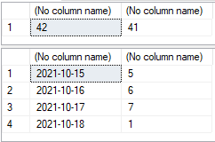
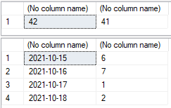
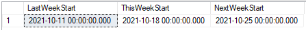
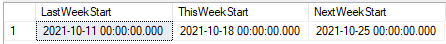

Tips
====

Clean cache
-----------

[↑ Up ↑](#tips)

```sql
CHECKPOINT ;
DBCC DROPCLEANBUFFERS WITH NO_INFOMSGS ;
DBCC FREEPROCCACHE WITH NO_INFOMSGS ;
DBCC FREESYSTEMCACHE ('ALL') WITH MARK_IN_USE_FOR_REMOVAL , NO_INFOMSGS ;
DBCC FREESESSIONCACHE WITH NO_INFOMSGS ;
CHECKPOINT ;
```

[↑ Up ↑](#tips)

Week date
---------

[↑ Up ↑](#tips)

```sql
SET LANGUAGE Italian

SELECT DATEPART(WK , CONVERT(DATETIME , '20211015')) , DATEPART(ISOWK , CONVERT(DATETIME , '20211015'))

SELECT '2021-10-15' , DATEPART(WEEKDAY , CONVERT(DATETIME , CONVERT(DATE , '2021-10-15')))
UNION
SELECT '2021-10-16' , DATEPART(WEEKDAY , CONVERT(DATETIME , CONVERT(DATE , '2021-10-16')))
UNION
SELECT '2021-10-17' , DATEPART(WEEKDAY , CONVERT(DATETIME , CONVERT(DATE , '2021-10-17')))
UNION
SELECT '2021-10-18' , DATEPART(WEEKDAY , CONVERT(DATETIME , CONVERT(DATE , '2021-10-18')))
```



```sql
SET LANGUAGE us_english

SELECT DATEPART(WK , CONVERT(DATETIME , '20211015')) , DATEPART(ISOWK , CONVERT(DATETIME , '20211015'))

SELECT '2021-10-15' , DATEPART(WEEKDAY , CONVERT(DATETIME , CONVERT(DATE , '2021-10-15')))
UNION
SELECT '2021-10-16' , DATEPART(WEEKDAY , CONVERT(DATETIME , CONVERT(DATE , '2021-10-16')))
UNION
SELECT '2021-10-17' , DATEPART(WEEKDAY , CONVERT(DATETIME , CONVERT(DATE , '2021-10-17')))
UNION
SELECT '2021-10-18' , DATEPART(WEEKDAY , CONVERT(DATETIME , CONVERT(DATE , '2021-10-18')))
```


```sql
SET LANGUAGE Italian

SELECT 
  DATEADD(WK, DATEDIFF(WK, 0, GETDATE()) - 1, 0) AS LastWeekStart
  ,
  DATEADD(WK, DATEDIFF(WK, 0, GETDATE()), 0) AS ThisWeekStart
  ,
  DATEADD(WK, DATEDIFF(WK, 0, GETDATE()) + 1, 0) AS NextWeekStart
```



```sql
SET LANGUAGE us_english

SELECT 
  DATEADD(WK, DATEDIFF(WK, 0, GETDATE()) - 1, 0) AS LastWeekStart
  ,
  DATEADD(WK, DATEDIFF(WK, 0, GETDATE()), 0) AS ThisWeekStart
  ,
  DATEADD(WK, DATEDIFF(WK, 0, GETDATE()) + 1, 0) AS NextWeekStart
```



[↑ Up ↑](#tips)

Object name
-----------

[↑ Up ↑](#tips)

As you probably already know, maximum length of object name in Microsoft SQL Server is limited to 128 characters.

This limitation also affects function ``QUOTENAME`` which can also take only maximum of 128 characters, even if you want to use this function to quote other values than object name.

Resulting quoted value may be longer. Let's check length of maximum length of some stupid object name like ``]]]]...``.

```sql
SELECT LEN(QUOTENAME(REPLICATE(']' , 128) , '['))
```

Resulting value will be 258 characters length and that seems to be maximum resulting value.

When considering maximum length of full object name containing server name, database name, schema name and table name, it will be then 258 * 4 + 3 (for dots) = 1035 characters or 258 * 3 + 2 (for dots) = 776 characters.

[↑ Up ↑](#tips)
